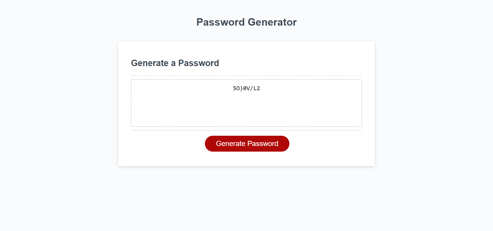

# hw-password-generator

[Link to deployed site](https://alexwilsonnc.github.io/hw-password-generator/)

[Link to github repository](https://github.com/AlexWilsonNC/hw-password-generator)

##Checklist:
- Prompt: Length of password (8-128)
- Prompt: Asks/includes Upper, Lower, Numbers, & special characters
- Prompt: Validated as long as one character type is selected by user
- Prompt: Password containing info is generated
- Prompt: Password is displayed on the page in the textarea

##Bonus Checklist:
- Alert when <8, >128, or NaN is entered in length prompt
- Alert if no character type is selected, message is displayed and the original prompt reappears from step 1
- Additional button clicks re-generates a new password, no page refresh needed

